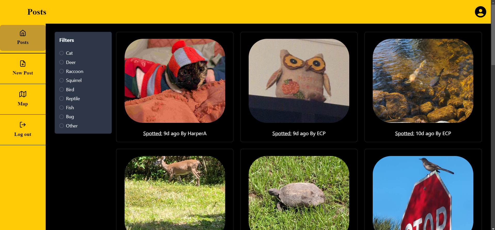
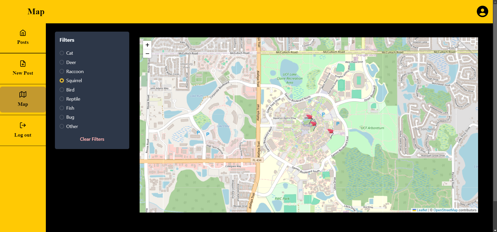
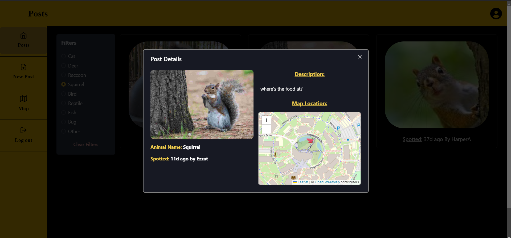
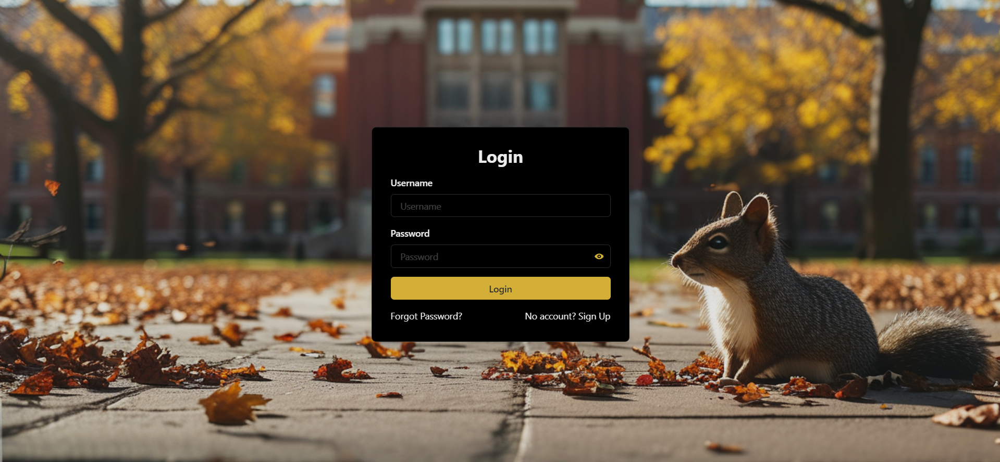

# **Campus Critters**

Campus Critters is a web and mobile application designed to empower the University of Central Florida (UCF) community to report, explore, and interact with real-time wildlife sightings on campus. Developed using the MERN stack (MongoDB, Express, React, Node.js) and Flutter, this platform fosters engagement and awareness of campus wildlife through geospatial visualizations, secure user features, and a seamless, intuitive interface.


## **Features**

- **User Authentication:** Secure login, registration, and email verification, with password recovery functionality.
- **Wildlife Reporting:** Upload images, provide descriptions, and tag locations of animal sightings on campus.
- **Interactive Maps:** Visualize sightings on an interactive map using **Leaflet** (web) and Flutter’s native map libraries (mobile).
- **Filtering:** Filter sightings by animal type to view all sightings of that animal.
- **Mobile App Integration:** Flutter-based mobile app for Android and iOS.
- **Responsive Design:** Modern, accessible UI built with **React** and **Chakra UI**.


## **Technology Stack**

| **Category**          | **Technology**                                                                                  |
|------------------------|-----------------------------------------------------------------------------------------------|
| **Frontend (Web)**     | [React](https://reactjs.org/) (TypeScript) with [Chakra UI](https://chakra-ui.com/)            |
| **Backend**            | [Node.js](https://nodejs.org/) with [Express](https://expressjs.com/)                         |
| **Database**           | [MongoDB](https://www.mongodb.com/)         |
| **Mobile**             | [Flutter](https://flutter.dev/) (Dart)                                                        |
| **Designs**  | [Figma](https://www.figma.com/)                  |
| **Hosting**            | [DigitalOcean](https://www.digitalocean.com/) (Custom domain)                                 |
| **Map Features**| [Leaflet](https://leafletjs.com/) (Web), Flutter’s map libraries (Mobile)                     |
| **API Documentation**  | [SwaggerHub](https://app.swaggerhub.com/apis/HA149538_1/AnimalTracker/1.0.0)                  |
| **Collaboration Tools**| [GitHub](https://github.com/), [Notion](https://www.notion.so/), [Figma](https://www.figma.com/) (for designs) |

## **Demo**

### **Mobile App Demo**
[Watch Mobile App Demo](https://vimeo.com/1031370989?share=copy)

### **Web App Screenshots**

*Home page showcasing real-time wildlife sightings.*


*Interactive map with wildlife markers.*


*Details of an animal sighting post.*


*Authentication page with Login view.*

## **API Documentation**

Full API documentation is available on [SwaggerHub](https://app.swaggerhub.com/apis/HA149538_1/AnimalTracker/1.0.0).  
All API endpoints, their usage, and example requests are detailed there.


## **Development Workflow**

1. **Project Management:** Tasks were tracked on **Notion** with weekly meetings and regular progress updates.
2. **Version Control:** Code managed via **GitHub**, with feature-based branching and pull requests.
3. **Testing:** APIs were tested using **Postman**, while unit testing ensured reliability for backend and Flutter components.
4. **Prototyping:** Designs created in **Figma**, iterated based on team feedback.


## **Lessons Learned**

- **Teamwork and Communication:** Effective collaboration tools and task assignment ensured smooth progress despite overlapping roles.
- **Technology Mastery:** Gained hands-on experience with React, ChakraUI, Notion, MongoDB, and managing an end-to-end full-stack + flutter project.
- **Time Management:** Successfully delivered a feature-complete app within a tight deadline.


## **Contributors**

| Name                | Role                                              |
|---------------------|---------------------------------------------------|
| **Ezzat Boukhary**  | Project Manager & Web Frontend Developer (React)  |
| **Harper Archambault** | API Developer & Frontend Support                |
| **Justin Rimmeli**  | Figma Designer & Frontend Support                 |
| **Noah Elder**      | Database Designer & API Support                   |
| **Ericka Price**    | Mobile Developer (Flutter)                        |


## **Setup and Installation**

### Prerequisites

1. **Node.js** (v16 or later)
2. **MongoDB** (Atlas or Local Instance)
3. **Flutter SDK** (v3.x or later)
4. **DigitalOcean Account** (or an alternative hosting platform)


### Backend Setup (API)

1. Navigate to the `API` directory:
   ```bash
   cd API
   ```

2. Install dependencies:
   ```bash
   npm install
   ```

3. The MongoDB connection string is **hardcoded** in the `server.js` file:
   ```javascript
   const url = 'mongodb+srv://<username>:<password>@<cluster-url>.mongodb.net/<dbname>?retryWrites=true&w=majority';
   const client = new MongoClient(url);
   ```

   Modify the `url` variable as needed for your MongoDB instance.

4. Start the server:
   ```bash
   npm start
   ```

The server runs on `http://localhost:5000` by default. Adjust the `PORT` in the `server.js` file if needed.


### Web Frontend Setup

1. Navigate to the `web_frontend` directory:
   ```bash
   cd ../frontend/web_frontend
   ```

2. Install dependencies:
   ```bash
   npm install
   ```

3. Start the development server:
   ```bash
   npm run dev
   ```

The app will run on `http://localhost:3000` by default.


### Mobile Frontend Setup

1. Navigate to the `mobile_frontend` directory:
   ```bash
   cd ../mobile_frontend
   ```

2. Install Flutter dependencies:
   ```bash
   flutter pub get
   ```

3. Run the app on a connected device or emulator:
   ```bash
   flutter run
   ```
